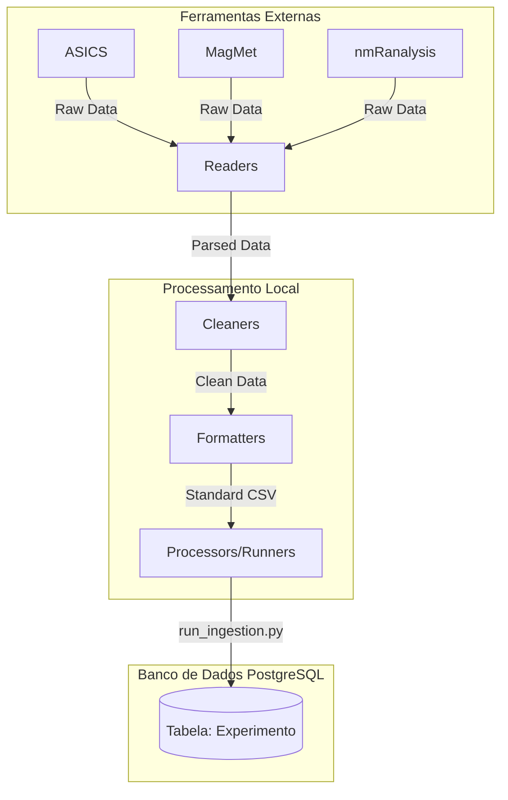
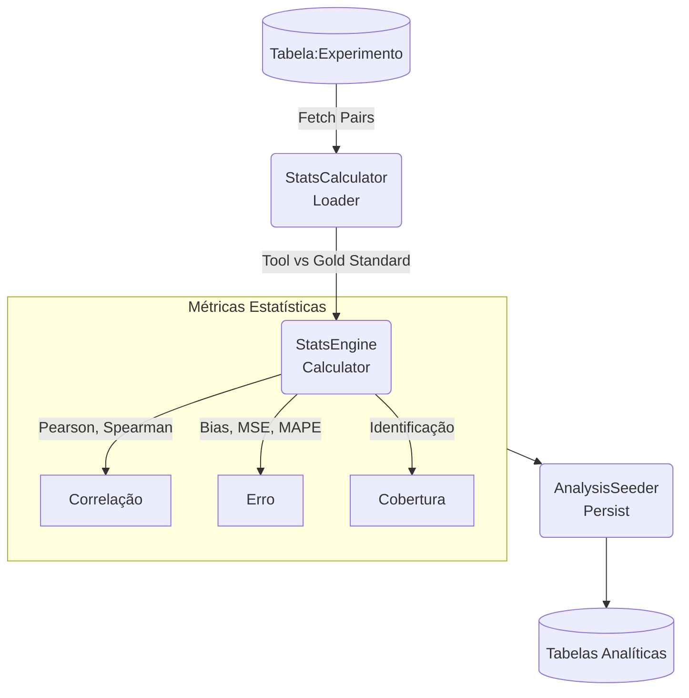

# NMR-data-analysis
**Projeto de Iniciação Científica** desenvolvido em conjunto com o LNBio.
**Documento Final**: ainda não disponível

**Objetivos:** 
- Desenvolver um software que padroniza dados de espectros RMN ¹H para um formato csv, pronto para ser testado em diversas ferramentas.
- Receber dados de perfilamento metabolômico de diferentes ferramentas, salvá-los em um banco de dados modelado rodando localmente em postgreSQL.
- Comparar o desempenho de diferentes ferramentas de perfilamento metabolômico (ASICS, MagMet, nmRanalysis) e salvar os resultados em um banco de dados.

**Projeto ainda em andamento. Ao final será disponibilizada a publicação e dados mais detalhados neste README.**

Transformation of NMR ¹H to a standardized data type and statistical review of different automated profiling softwares.

## Arquitetura do Projeto e Pipelines

O projeto foi construído utilizando uma arquitetura modular focada no processamento de dados e em cálculos analíticos robustos. A separação de responsabilidades garante uma fácil adição de novas ferramentas e escalabilidade.

### 1. Pipeline de Ingestão de Dados

O fluxo de processamento de dados inicial (Sprint 1 e 2) é responsável por ler os outputs crus de diversas ferramentas, padronizá-los e armazená-los no banco de dados.

- **Readers:** Responsáveis pela leitura dos arquivos brutos específicos de cada ferramenta.
- **Cleaners:** Efetuam a limpeza dos dados, remoção de redundâncias e correção de cabeçalhos inconsistentes (ex: prefixos/sufixos indesejados).
- **Formatters:** Padronizam os dados para o formato esperado pelo projeto (`csv` estruturado).
- **Ingestion Runner (`run_ingestion.py`):** Utiliza o `ExperimentSeeder` para ingerir programaticamente os arquivos processados no Supabase (PostgreSQL), utilizando rotinas para evitar duplicidade.

### 2. Pipeline de Análise Estatística

O fluxo analítico (Sprint 3) recupera os dados persistidos, cruza-os com o *Gold Standard* (Padrão Ouro), e computa as métricas de desempenho.

- **Loader (`StatsCalculator`):** Busca as observações pareadas de uma ferramenta alvo contra os dados do *Gold Standard* armazenados no banco de dados.
- **Calculator (`StatsEngine`):** Processa os resultados em 3 níveis de granularidade (Por espectro, por biofluido e global) realizando o cálculo estatístico de variadas métricas.
- **Persist (`AnalysisSeeder`):** Consolida e salva (via upsert) os resultados de volta para as tabelas analíticas no banco de dados.
- **Analysis Runner (`run_analysis.py`):** Script orquestrador que executa o pipeline de forma automatizada.

## O que foi feito até o momento

Até agora, o desenvolvimento focou em estruturar a base de dados e criar uma arquitetura robusta para o processamento de dados e análise estatística:

- **Arquitetura Modular (Pipeline de Dados e Análise):**
  - Implementação de um padrão de projeto dividindo as responsabilidades em etapas lógicas (Readers, Cleaners, Formatters, Runners e Calculators).
  - Separação de lógicas específicas para as ferramentas (ASICS, MagMet e nmRanalysis).

- **Processamento e Padronização:**
  - Criação de scripts em Python para ingestão programática e transformação (ex: conversores `csv_to_jsonb.py` e extração automática de metadados).
  - Padronização no formato de dados consumíveis por pacotes R ou tabelas SQL.

- **Banco de Dados (Supabase / PostgreSQL):**
  - Configuração de um banco de dados PostgreSQL com integração via Supabase.
  - Implementação de constraints complexas, functions (como `ingest_experiment_data.sql`), views e rotinas de seeder (Seeders manuais, para factory e hmdb).

- **Qualidade de Código e Testes:**
  - Refatoração contínua e adoção de injeção de dependências.
  - Criação de suítes de testes amplas (unitárias e de integração) validando banco de dados, limpeza de CSVs, consistência de JSONs e concorrência no processo de ingestão.
