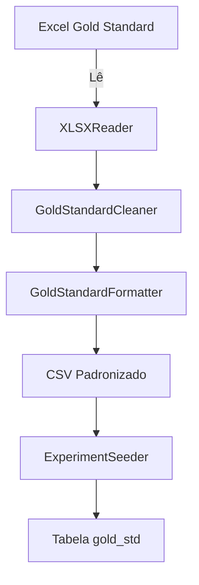
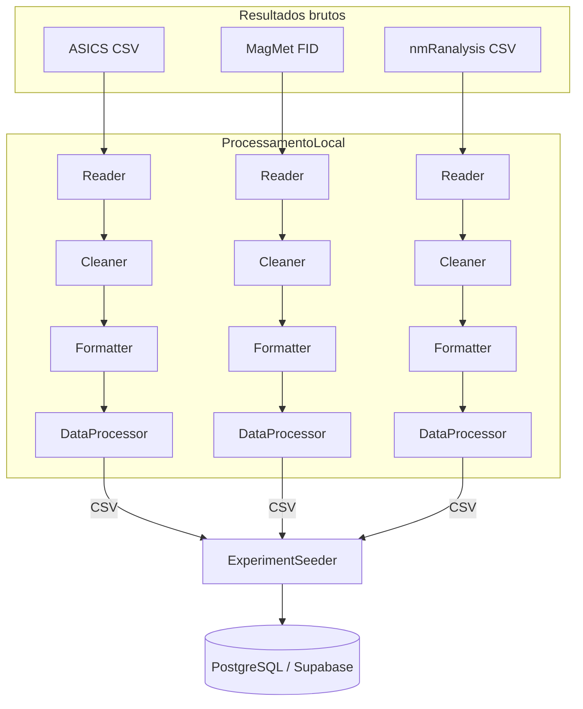
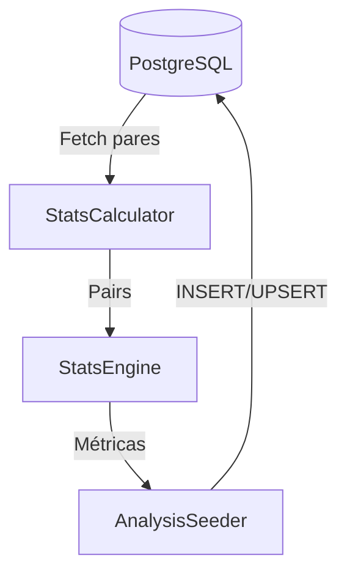
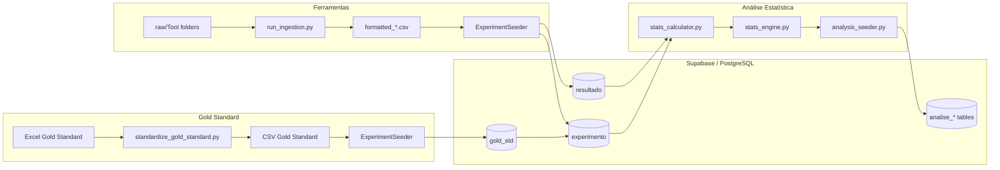

# NMR-data-analysis
## Overview
This repository contains the pipeline for the standardization and statistical analysis of NMR ¹H metabolomics spectroscopy data. The data comes from different metabolomics profiling software such as ASICS, MagMet, nmrAnalysis. This project was developed as an undergraduate research in collaboration with LNBio and CNPEM.

## Visão geral
Este repositório contém todo o fluxo de **processamento, padronização e análise estatística** de dados de espectroscopia de RMN \(¹H\) provenientes de diferentes ferramentas de profiling metabolômico (ASICS, MagMet e nmRanalysis). O projeto foi desenvolvido como parte de uma iniciação científica com o LNBio e o CNPEM e está pronto para uso em novos conjuntos de dados.

---

## Pipelines completos

### 1️⃣ Pipeline de **Padronização do Gold Standard**
1. **Entrada** – Arquivo Excel bruto `data/raw/Gold_Standard/<biofluido>/concentrations.xlsx`.
2. **`standardize_gold_standard.py`**
   - Lê o Excel com `XLSXReader`.
   - `GoldStandardCleaner` identifica a linha de início dos dados, extrai nomes de amostras e concentrações, remove sufixos `.cnx` e converte tudo para `float`.
   - `GoldStandardFormatter` transpõe a tabela para que **linhas = metabólitos** e **colunas = amostras**.
   - Salva o CSV padronizado em `data/processed/formatted/Complete/LNBioGS_<biofluido>.csv`.
3. **Ingestão** – `experiment_seeder.py` lê o CSV e insere os valores na tabela `gold_std`.



### 2️⃣ Pipeline de **Ingestão de Ferramentas**
1. **Entrada** – Resultados brutos das ferramentas (CSV ou FID) em `data/raw/Tool/...`.
2. **Leitura** – `src/readers` identifica o formato e carrega em `DataFrame`.
3. **Limpeza** – Cada `cleaner` (ex.: `ASICS_cleaner`, `MagMet_cleaner`, `nmRanalysis_cleaner`) corrige cabeçalhos, remove linhas vazias e converte valores.
4. **Formatação** – `src/formatter` garante um layout **linhas = amostras**, **colunas = metabólitos**.
5. **Processamento** – `DataProcessor` (via `run_ingestion.py`) combina `reader → cleaner → formatter` e grava CSV temporário `formatted_<tool>.csv`.
6. **Seed** – `experiment_seeder.py` lê o CSV formatado e populates:
   - `experimento` (metadados de espectro)
   - `resultado` (valores de cada ferramenta)
   - `ferramenta` (referência da ferramenta)



### 3️⃣ Pipeline de **Análise Estatística**
1. **Carregamento** – `stats_calculator.py` consulta pares `(tool result, gold standard)` da base (`resultado` ↔ `gold_std`).
2. **Cálculo** – `stats_engine.py` computa:
   - Correlação de Pearson & Spearman (`pearson_r`, `pearson_p`, `spearman_r`, `spearman_p`)
   - Erros (Bias, MSE, MAPE)
   - Cobertura/Identificação (`identificados_gs_percent`, `cobertura_percent`)
3. **Persistência** – `analysis_seeder.py` upserta resultados nas tabelas:
   - `analise_espectro` (por experimento & ferramenta)
   - `analise_metabolito` (por metabólito & ferramenta)
   - `analise_ferramenta` (por combinação de ferramentas)
4. **Orquestração** – `run_analysis.py` executa todo o fluxo.



### 4️⃣ **Fluxo completo do projeto**


---

## Como executar o pipeline completo
1. **Padronizar Gold Standard**
   ```bash
   python -m Scripts.standardize_gold_standard
   ```
2. **Ingerir resultados das ferramentas**
   ```bash
   python -m database.seeders.experiment_seeder
   ```
3. **Calcular e persistir métricas**
   ```bash
   python -m runners.run_analysis
   ```

> ** Observação:** As p‑valores `pearson_p` e `spearman_p` podem aparecer como `0.0` quando o número de observações é muito grande (ex.: >10 000). Nesse caso o valor está abaixo do limite de precisão (`≈4.9e‑324`) e o banco o grava como zero; estatisticamente isso indica **significância extrema (p < 10⁻³²⁴)**.
